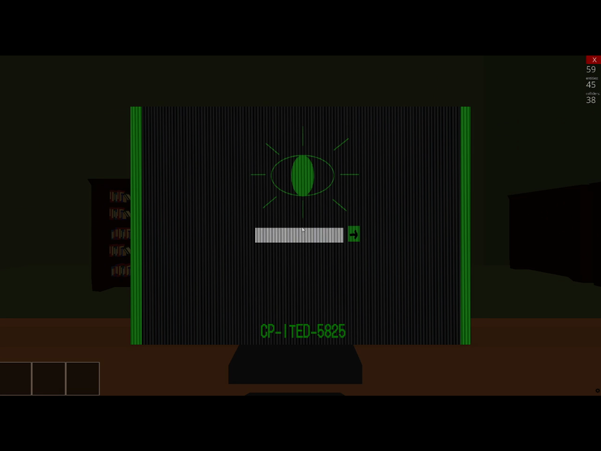

# AlterFiction

**3D horror puzzle game developed in Python using the Ursina engine.**  
A project combining immersive environments, custom assets and interactive gameplay mechanics.

> ⚠️ For full experience, download full project from Google Drive.

---

## 🎬 Trailer
Watch the game trailer:  
https://youtu.be/TwoBgaMWtTw?si=bpNOpaehQBri_5-b

---

## 🖼️ Preview


---

## 📌 Project Overview

AlterFiction is a 3D horror puzzle game where players explore different environments, solve puzzles and interact with objects to progress through the game.

The project features:
- Multiple maps and levels  
- Puzzle-based progression  
- Interactive objects and mechanics  
- Custom-made 3D models and sound effects  
- An original narrative and atmosphere  

---

## 🧠 Context

This project was developed over several months as part of a school project, in collaboration with a team.  
It involved the full development cycle of a game: design, programming, asset integration and testing.

---

## 👥 Authors

- Ithushan Inpakumar  
- Eddy Wang Cheng  
- Battuvshin Munkhjargal  

---

## ⚙️ Technologies Used

- Python  
- Ursina Engine  

---

## 🚀 How to Run

### Requirements
- Python 3.11  
- Ursina Engine  

⚠️ Note: The game may not display correctly on some MacBooks. A Windows environment is recommended.

---

### Installation

Install Python:  
https://www.python.org/downloads/

Install Ursina:
```bash
pip install ursina
```

---

### Launch the Game

```bash
python alterfiction.py
```

---

## 🎮 Controls

- **ZQSD** → Move  
- **E** → Interact / Exit interaction  
- **F** → Flashlight  
- **O** → Skip introduction  

Some interactions may require mouse input.

---

## 📂 Full Project

The complete version of the project (including assets such as audio, models and textures) is available here:  
https://drive.google.com/drive/folders/1ct0BEjwiRT5X86IbiEQgVXYYPB10Qsj3?usp=sharing

---

## 🧩 Performance Notes

- Loading times may vary depending on your computer  
- Avoid interacting repeatedly during loading  
- Avoid switching windows while loading  

---

## 📘 Notes

Some parts of the code include comments in French due to the context in which the project was developed.  
However, the structure and logic remain clear and understandable.

---

## 📈 What I Learned

- Structuring and organizing a large-scale project  
- Working with 3D environments and assets  
- Implementing gameplay systems and interactions  
- Debugging and solving complex technical issues  
- Collaborating effectively within a team  

---

## 🔮 Future Improvements

- Improve performance and loading times  
- Enhance graphics and visual effects  
- Add new maps and gameplay mechanics  
- Refactor parts of the code for better scalability  

---
